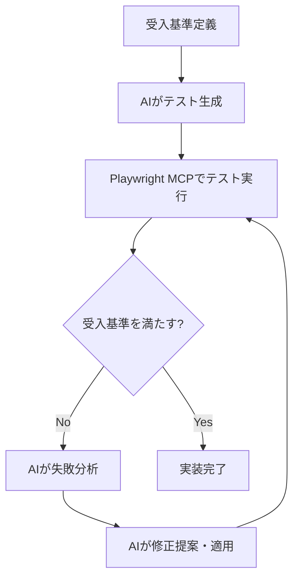

# 設計書

## 概要

本システムは、GitHubのPRレビューコメントから重要な知見を自動抽出し、コーディング規約ファイル（agents/policy.md）に蓄積するナレッジ管理システムである。GitHub Actionsをトリガー層、Mastraフレームワークをアプリケーション層として採用し、段階的な機能拡張（MVP → AI キュレーション）を可能にする設計とする。

Mastraの標準的なディレクトリ構成とベストプラクティスに従い、agents、tools、workflowsを明確に分離した構造を採用する。

## アーキテクチャ

### システム構成図

```mermaid
graph TB
    A[GitHub PR Comment] -->|[must]タグ検出| B[GitHub Actions Workflow]
    B -->|環境構築| C[Ubuntu Runner + Node.js]
    C -->|npm run mastra:run| D[Mastra Application Entry]
    D -->|MVP| E[Simple Append Workflow]
    D -->|発展| F[Knowledge Update Workflow]
    E -->|fileWriterTool| G[agents/policy.md]
    F -->|fileReaderTool| H[既存ナレッジ読み込み]
    H -->|curationAgent| I[重複チェック・要約]
    I -->|新規判定| J[fileWriterTool]
    J -->|追記| G
    G -->|gitCommitTool| K[Git Commit & Push]
    K -->|プッシュ| L[PR Branch]
```

### レイヤー構成

1. **トリガー層**: GitHub Actions (`issue_comment`イベント)
2. **実行環境層**: GitHub Actions Runner (Ubuntu + Node.js 20.x)
3. **アプリケーション層**: Mastra Application (TypeScript)
   - `src/mastra/index.ts` - Mastraインスタンス
   - `src/mastra/agents/` - エージェント定義
   - `src/mastra/tools/` - ツール定義
   - `src/mastra/workflows/` - ワークフロー定義
4. **データ層**: agents/policy.md (Markdown形式のナレッジベース)

## プロジェクト構造

### ディレクトリ構成

```
review-metrics-knowledge/
├── .github/
│   └── workflows/
│       └── knowledge-automation.yml    # GitHub Actions ワークフロー
├── src/
│   ├── mastra/
│   │   ├── index.ts                    # Mastraインスタンス
│   │   ├── agents/
│   │   │   └── curation-agent.ts       # キュレーションエージェント
│   │   ├── tools/
│   │   │   ├── file-reader-tool.ts     # ファイル読み込みツール
│   │   │   ├── file-writer-tool.ts     # ファイル書き込みツール
│   │   │   └── git-commit-tool.ts      # Git操作ツール
│   │   └── workflows/
│   │       ├── simple-append-workflow.ts      # MVP: シンプル追記
│   │       └── knowledge-update-workflow.ts   # 発展: AIキュレーション
│   └── run.ts                          # 実行エントリーポイント
├── agents/
│   └── policy.md                       # ナレッジベース
├── .env                                # 環境変数
├── package.json
└── tsconfig.json
```

## コンポーネントと インターフェース

### 1. GitHub Actions Workflow

**ファイルパス**: `.github/workflows/knowledge-automation.yml`

**トリガー条件**:
```yaml
on:
  issue_comment:
    types: [created]
```

**実行条件**:
- PRに紐づくコメントであること (`github.event.issue.pull_request`が存在)
- コメント本文が`[must]`で始まること

**環境変数**:
- `GEMINI_API_KEY`: GitHub Secretsから取得
- `COMMENT_BODY`: イベントペイロードから抽出したコメント本文（[must]除去済み）
- `COMMENT_URL`: コメントのURL
- `PR_BRANCH`: PRのブランチ名
- `TIMESTAMP`: ISO 8601形式のタイムスタンプ

**権限**:
```yaml
permissions:
  contents: write
```

**ワークフロー定義例**:
```yaml
name: 📝 Knowledge Automation
on:
  issue_comment:
    types: [created]

jobs:
  process-must-comment:
    if: github.event.issue.pull_request && startsWith(github.event.comment.body, '[must]')
    runs-on: ubuntu-latest
    
    steps:
      - uses: actions/checkout@v5
        with:
          ref: ${{ github.event.pull_request.head.ref }}
      
      - uses: actions/setup-node@v6
        with:
          node-version: '20.x'
      
      - run: npm install
      
      - name: Run Mastra Application
        run: npm run mastra:run
        env:
          GEMINI_API_KEY: ${{ secrets.GEMINI_API_KEY }}
          COMMENT_BODY: ${{ github.event.comment.body }}
          COMMENT_URL: ${{ github.event.comment.html_url }}
          PR_BRANCH: ${{ github.event.pull_request.head.ref }}
          TIMESTAMP: ${{ github.event.comment.created_at }}
```

### 2. Mastra Application Entry Point

**ファイルパス**: `src/run.ts`

**主要な責務**:
- 環境変数からコメント情報を取得
- [must]接頭辞の除去
- ワークフローの実行
- エラーハンドリングとログ出力

**実装例**:
```typescript
import { mastra } from "./mastra";

async function main() {
  try {
    // 環境変数から取得
    const commentBody = process.env.COMMENT_BODY || "";
    const commentUrl = process.env.COMMENT_URL || "";
    const prBranch = process.env.PR_BRANCH || "";
    const timestamp = process.env.TIMESTAMP || new Date().toISOString();
    
    // [must]接頭辞を除去
    const cleanedBody = commentBody.replace(/^\[must\]\s*/i, "");
    
    // ワークフロー実行（MVP or 発展）
    const useAICuration = process.env.USE_AI_CURATION === "true";
    const workflowName = useAICuration 
      ? "knowledgeUpdateWorkflow" 
      : "simpleAppendWorkflow";
    
    const workflow = mastra.getWorkflow(workflowName);
    const result = await workflow.execute({
      triggerData: {
        comment: {
          body: cleanedBody,
          url: commentUrl,
          timestamp: timestamp
        },
        prBranch: prBranch
      }
    });
    
    console.log("✅ Workflow completed:", result);
    process.exit(0);
  } catch (error) {
    console.error("❌ Error:", error);
    process.exit(1);
  }
}

main();
```

### 3. Mastra Instance

**ファイルパス**: `src/mastra/index.ts`

**実装例**:
```typescript
import { Mastra } from "@mastra/core";
import { curationAgent } from "./agents/curation-agent";
import { simpleAppendWorkflow } from "./workflows/simple-append-workflow";
import { knowledgeUpdateWorkflow } from "./workflows/knowledge-update-workflow";

export const mastra = new Mastra({
  agents: {
    curationAgent
  },
  workflows: {
    simpleAppendWorkflow,
    knowledgeUpdateWorkflow
  }
});
```

### 4. Mastra Tools

#### FileReaderTool

**ファイルパス**: `src/mastra/tools/file-reader-tool.ts`

**目的**: agents/policy.mdの内容を読み込む

**実装**:
```typescript
import { createTool } from "@mastra/core/tools";
import { z } from "zod";
import fs from "fs/promises";

export const fileReaderTool = createTool({
  id: "file-reader",
  description: "Reads content from a file",
  
  inputSchema: z.object({
    filePath: z.string().describe("Path to the file to read"),
    encoding: z.enum(["utf-8", "ascii"]).default("utf-8")
  }),
  
  outputSchema: z.object({
    content: z.string(),
    exists: z.boolean()
  }),
  
  execute: async ({ context }) => {
    const { filePath, encoding } = context;
    
    try {
      const content = await fs.readFile(filePath, encoding);
      return {
        content,
        exists: true
      };
    } catch (error) {
      // ファイルが存在しない場合は空文字列を返す
      return {
        content: "",
        exists: false
      };
    }
  }
});
```

#### FileWriterTool

**ファイルパス**: `src/mastra/tools/file-writer-tool.ts`

**目的**: agents/policy.mdに整形済みテキストを追記

**実装**:
```typescript
import { createTool } from "@mastra/core/tools";
import { z } from "zod";
import fs from "fs/promises";

export const fileWriterTool = createTool({
  id: "file-writer",
  description: "Writes or appends content to a file",
  
  inputSchema: z.object({
    filePath: z.string().describe("Path to the file"),
    content: z.string().describe("Content to write"),
    mode: z.enum(["write", "append"]).default("append")
  }),
  
  outputSchema: z.object({
    success: z.boolean(),
    bytesWritten: z.number()
  }),
  
  execute: async ({ context }) => {
    const { filePath, content, mode } = context;
    
    try {
      // ディレクトリが存在しない場合は作成
      const dir = filePath.substring(0, filePath.lastIndexOf("/"));
      await fs.mkdir(dir, { recursive: true });
      
      if (mode === "append") {
        await fs.appendFile(filePath, content, "utf-8");
      } else {
        await fs.writeFile(filePath, content, "utf-8");
      }
      
      const bytesWritten = Buffer.byteLength(content, "utf-8");
      
      return {
        success: true,
        bytesWritten
      };
    } catch (error) {
      throw new Error(`Failed to write file: ${error.message}`);
    }
  }
});
```

**追記フォーマット**:
```markdown
---
## [追加日時: 2025-10-16 14:30:00]
出典: https://github.com/org/repo/pull/123#issuecomment-456

変数名は具体的で意味が明確な名前を使用すること。
単一文字の変数名（i, j, k以外）は避けるべきである。

```

#### GitCommitTool

**ファイルパス**: `src/mastra/tools/git-commit-tool.ts`

**目的**: 変更をコミット・プッシュ

**実装**:
```typescript
import { createTool } from "@mastra/core/tools";
import { z } from "zod";
import simpleGit from "simple-git";

export const gitCommitTool = createTool({
  id: "git-commit",
  description: "Commits and pushes changes to a Git repository",
  
  inputSchema: z.object({
    filePaths: z.array(z.string()).describe("Files to commit"),
    commitMessage: z.string().describe("Commit message"),
    branch: z.string().describe("Branch to push to")
  }),
  
  outputSchema: z.object({
    success: z.boolean(),
    commitHash: z.string().optional(),
    error: z.string().optional()
  }),
  
  execute: async ({ context }) => {
    const { filePaths, commitMessage, branch } = context;
    const git = simpleGit();
    
    try {
      // Gitユーザー設定（GitHub Actionsの場合）
      await git.addConfig("user.name", "github-actions[bot]");
      await git.addConfig("user.email", "github-actions[bot]@users.noreply.github.com");
      
      // ファイルをステージング
      await git.add(filePaths);
      
      // コミット
      const commitResult = await git.commit(commitMessage);
      
      // プッシュ
      await git.push("origin", branch);
      
      return {
        success: true,
        commitHash: commitResult.commit
      };
    } catch (error) {
      return {
        success: false,
        error: error.message
      };
    }
  }
});
```

### 5. Curation Agent (発展要件)

**ファイルパス**: `src/mastra/agents/curation-agent.ts`

**役割**: 新規コメントの重複判定と要約

**実装**:
```typescript
import { Agent } from "@mastra/core/agent";
import { google } from "@ai-sdk/google";

export const curationAgent = new Agent({
  name: "curation-agent",
  
  instructions: `
あなたは熟練のテクニカルライターです。
新しいレビューコメントと既存のコーディング規約を比較し、以下を判定してください：

1. 重複判定: 新規コメントが既存ルールと意味的に80%以上重複するか
2. 要約: 重複していない場合、コメントを汎用的で規範的なルールに要約

出力形式（必ずJSON形式で返してください）:
{
  "isDuplicate": boolean,
  "reason": "判定理由",
  "summarizedRule": "要約されたルール（新規の場合のみ）"
}

重要:
- 既存ルールと新規コメントの意味的な類似度を慎重に評価してください
- 要約する際は、具体的な事例ではなく汎用的なルールに変換してください
- 出力は必ず有効なJSON形式にしてください
  `,
  
  model: {
    provider: google("gemini-2.0-flash-exp"),
    toolChoice: "auto"
  }
});
```

**使用方法**:
```typescript
const result = await curationAgent.generate({
  messages: [{
    role: "user",
    content: `既存ルール:\n${existingContent}\n\n新規コメント:\n${newComment}`
  }]
});

const parsed = JSON.parse(result.text);
// parsed.isDuplicate, parsed.reason, parsed.summarizedRule
```

### 6. Simple Append Workflow (MVP)

**ファイルパス**: `src/mastra/workflows/simple-append-workflow.ts`

**目的**: [must]コメントをそのままagents/policy.mdに追記

**実装**:
```typescript
import { Workflow } from "@mastra/core/workflows";
import { z } from "zod";
import { fileWriterTool } from "../tools/file-writer-tool";
import { gitCommitTool } from "../tools/git-commit-tool";

export const simpleAppendWorkflow = new Workflow({
  name: "simple-append-workflow",
  triggerSchema: z.object({
    comment: z.object({
      body: z.string(),
      url: z.string().url(),
      timestamp: z.string().datetime()
    }),
    prBranch: z.string()
  })
});

simpleAppendWorkflow
  .step({
    id: "format-and-append",
    execute: async ({ context }) => {
      const { comment, prBranch } = context.triggerData;
      
      // フォーマット
      const formattedContent = `
---
## [追加日時: ${new Date(comment.timestamp).toLocaleString("ja-JP")}]
出典: ${comment.url}

${comment.body}

`;
      
      // ファイルに追記
      const writeResult = await fileWriterTool.execute({
        context: {
          filePath: "agents/policy.md",
          content: formattedContent,
          mode: "append"
        }
      });
      
      return writeResult;
    }
  })
  .then({
    id: "commit-changes",
    execute: async ({ context }) => {
      const { comment, prBranch } = context.triggerData;
      
      // Gitコミット・プッシュ
      const commitResult = await gitCommitTool.execute({
        context: {
          filePaths: ["agents/policy.md"],
          commitMessage: `chore: [must]コメントからナレッジ自動追加\n\n出典: ${comment.url}`,
          branch: prBranch
        }
      });
      
      return commitResult;
    }
  });
```

### 7. Knowledge Update Workflow (発展要件)

**ファイルパス**: `src/mastra/workflows/knowledge-update-workflow.ts`

**目的**: AIによる重複チェックと要約を行った上でagents/policy.mdに追記

**実装**:
```typescript
import { Workflow } from "@mastra/core/workflows";
import { z } from "zod";
import { fileReaderTool } from "../tools/file-reader-tool";
import { fileWriterTool } from "../tools/file-writer-tool";
import { gitCommitTool } from "../tools/git-commit-tool";
import { mastra } from "../index";

export const knowledgeUpdateWorkflow = new Workflow({
  name: "knowledge-update-workflow",
  triggerSchema: z.object({
    comment: z.object({
      body: z.string(),
      url: z.string().url(),
      timestamp: z.string().datetime()
    }),
    prBranch: z.string()
  })
});

// Step 1: 既存ナレッジベースを読み込む
knowledgeUpdateWorkflow
  .step({
    id: "read-knowledge-base",
    execute: async ({ context }) => {
      const result = await fileReaderTool.execute({
        context: {
          filePath: "agents/policy.md",
          encoding: "utf-8"
        }
      });
      
      return {
        existingContent: result.content,
        exists: result.exists
      };
    }
  })
  
  // Step 2: AIによるキュレーション（重複チェック・要約）
  .then({
    id: "curate-comment",
    execute: async ({ context }) => {
      const { existingContent } = context.getStepResult("read-knowledge-base");
      const { comment } = context.triggerData;
      
      // Curation Agentを取得
      const curationAgent = mastra.getAgent("curationAgent");
      
      // AIエージェントを呼び出して重複判定と要約を実行
      const curationResult = await curationAgent.generate({
        messages: [{
          role: "user",
          content: `既存ルール:\n${existingContent}\n\n新規コメント:\n${comment.body}`
        }]
      });
      
      // JSON パース
      const parsed = JSON.parse(curationResult.text);
      
      return {
        isDuplicate: parsed.isDuplicate,
        reason: parsed.reason,
        summarizedRule: parsed.summarizedRule
      };
    }
  })
  
  // Step 3: 条件分岐 - 新規の場合のみ追記
  .then({
    id: "conditional-append",
    execute: async ({ context }) => {
      const curationResult = context.getStepResult("curate-comment");
      const { comment, prBranch } = context.triggerData;
      
      // 重複している場合はスキップ
      if (curationResult.isDuplicate) {
        console.log(`⏭️  Skipped: ${curationResult.reason}`);
        return {
          skipped: true,
          reason: curationResult.reason
        };
      }
      
      // 新規ルールをフォーマット
      const formattedContent = `
---
## [追加日時: ${new Date(comment.timestamp).toLocaleString("ja-JP")}]
出典: ${comment.url}

${curationResult.summarizedRule}

`;
      
      // ファイルに追記
      await fileWriterTool.execute({
        context: {
          filePath: "agents/policy.md",
          content: formattedContent,
          mode: "append"
        }
      });
      
      // Gitコミット・プッシュ
      await gitCommitTool.execute({
        context: {
          filePaths: ["agents/policy.md"],
          commitMessage: `chore: [must]コメントからナレッジ自動追加（AI要約）\n\n出典: ${comment.url}`,
          branch: prBranch
        }
      });
      
      console.log("✅ Knowledge added successfully");
      
      return {
        success: true,
        added: true
      };
    }
  });
```

## データモデル

### CommentInput（トリガーデータ）

```typescript
interface CommentInput {
  comment: {
    body: string;          // [must]を除去したコメント本文
    url: string;           // コメントのURL
    timestamp: string;     // ISO 8601形式のタイムスタンプ
  };
  prBranch: string;        // PRのブランチ名
}
```

### CurationResult（AIキュレーション結果）

```typescript
interface CurationResult {
  isDuplicate: boolean;      // 重複判定結果
  reason: string;            // 判定理由
  summarizedRule?: string;   // 要約されたルール（新規の場合のみ）
}
```

### KnowledgeEntry（agents/policy.md内のエントリー）

Markdown形式で保存される各エントリーの構造:

```markdown
---
## [追加日時: 2025-10-16 14:30:00]
出典: https://github.com/org/repo/pull/123#issuecomment-456

変数名は具体的で意味が明確な名前を使用すること。
単一文字の変数名（i, j, k以外）は避けるべきである。

---
```

**フォーマット仕様**:
- 区切り線: `---`
- 見出し: `## [追加日時: YYYY-MM-DD HH:mm:ss]`
- 出典: `出典: [URL]`
- ルール本文: プレーンテキスト（MVPの場合は元のコメント、発展要件の場合はAI要約）
- 末尾の空行

## エラーハンドリング

### エラー分類と対応

| エラー種別 | 検出箇所 | 対応方法 |
|----------|---------|---------|
| ファイル読み込み失敗 | FileReaderTool | 空文字列を返し、新規作成フラグを立てる |
| ファイル書き込み失敗 | FileWriterTool | エラーログ出力、ワークフロー失敗 |
| Git操作失敗 | GitCommitTool | 詳細エラーログ出力、リトライ1回 |
| AI API呼び出し失敗 | Curation Agent | タイムアウト5秒、失敗時はMVPモードにフォールバック |
| JSON パース失敗 | Workflow Step 3 | エラーログ出力、MVPモードにフォールバック |

### ログ出力仕様

**レベル定義**:
- `INFO`: 正常な処理フロー
- `WARN`: フォールバック発生
- `ERROR`: 処理失敗

**出力項目**:
```typescript
interface LogEntry {
  level: 'INFO' | 'WARN' | 'ERROR';
  timestamp: string;
  component: string;  // 'workflow' | 'agent' | 'tool'
  message: string;
  metadata?: Record<string, any>;
}
```

### OpenTelemetry トレース

**Span構成**:
```
root: process-must-comment
├─ read-knowledge-base
├─ curate-comment (発展要件のみ)
│  └─ gemini-api-call
├─ append-knowledge
└─ git-commit-push
```

## テスト戦略

本プロジェクトでは、**AI駆動の受入基準ベーステスト（Acceptance Criteria-Driven Testing）**を採用します。Playwright MCPを活用し、各タスクの受入基準を満たすまでAIが自動的にテスト・修正を繰り返します。

### テスト戦略の概要



### 従来のアプローチ vs AI駆動アプローチ

| 従来のアプローチ | AI駆動アプローチ（本プロジェクト） |
|--------------|--------------------------|
| 開発者が手動でテストコードを記述 | AIが受入基準から自動的にテストを生成 |
| 手動でテストを実行・確認 | Playwright MCPが自動的にテストを実行 |
| エラー発生時に手動でデバッグ | AIが自動的にエラーを分析・修正 |
| テストの保守に時間がかかる | AIが自動的にテストを最適化 |

### Playwright MCP の活用

#### 利用可能なMCPツール

本プロジェクトで使用するPlaywright MCPツール：

| ツール名 | 用途 | 使用例 |
|---------|------|--------|
| `playwright_navigate` | URLに移動 | GitHub PRページへの遷移 |
| `playwright_screenshot` | スクリーンショット取得 | テスト結果の視覚的確認 |
| `playwright_click` | 要素をクリック | コメント投稿ボタンのクリック |
| `playwright_fill` | フォーム入力 | [must]コメントの入力 |
| `playwright_get_visible_text` | 表示テキスト取得 | agents/policy.mdの内容確認 |
| `playwright_evaluate` | JavaScript実行 | GitHub APIの呼び出し |

#### MCP設定

`.kiro/settings/mcp.json`:
```json
{
  "mcpServers": {
    "playwright": {
      "command": "npx",
      "args": ["-y", "@playwright/mcp@latest"]
    }
  }
}
```

### テストレベルと戦略

#### 1. 単体テスト（Unit Tests）

**対象**:
- 各Mastra Tool（FileReader, FileWriter, GitCommit）
- ユーティリティ関数（フォーマット処理、パース処理）

**テストフレームワーク**: Vitest

**AI駆動アプローチ**:
1. AIが各ツールの受入基準を分析
2. テストケースを自動生成
3. エッジケースを自動的に追加

**カバレッジ目標**: 80%以上

**実装例**:
```typescript
// AIが生成するテスト例
describe('FileReaderTool', () => {
  test('should read existing file', async () => {
    const result = await fileReaderTool.execute({
      context: { filePath: 'test.md', encoding: 'utf-8' }
    });
    expect(result.exists).toBe(true);
    expect(result.content).toBeDefined();
  });
  
  test('should handle non-existent file', async () => {
    const result = await fileReaderTool.execute({
      context: { filePath: 'non-existent.md', encoding: 'utf-8' }
    });
    expect(result.exists).toBe(false);
    expect(result.content).toBe('');
  });
});
```

#### 2. 統合テスト（Integration Tests）

**目的**: Mastra Workflowの動作を検証

**AI駆動アプローチ**:
1. ワークフローの受入基準を定義
2. AIがテストシナリオを生成
3. Playwright MCPで実際のファイル操作を検証

**シナリオ1: MVP機能の正常系**
```
受入基準:
- WHEN [must]コメントが入力される
  THEN agents/policy.mdに正しくフォーマットされて追記される
- WHEN 追記が完了する
  THEN Gitコミット・プッシュが成功する
```

**AIが生成するテスト**:
```typescript
test('MVP workflow: simple append', async () => {
  // AIがPlaywright MCPを使用してテスト実行
  const workflow = mastra.getWorkflow('simpleAppendWorkflow');
  const result = await workflow.execute({
    triggerData: {
      comment: {
        body: 'テストコメント',
        url: 'https://github.com/test/pr/1',
        timestamp: new Date().toISOString()
      },
      prBranch: 'test-branch'
    }
  });
  
  // Playwright MCPでファイル内容を検証
  const fileContent = await playwright_evaluate({
    script: 'fs.readFileSync("agents/policy.md", "utf-8")'
  });
  
  expect(fileContent).toContain('テストコメント');
  expect(result.success).toBe(true);
});
```

**シナリオ2: 発展機能の重複検出**
```
受入基準:
- WHEN 既存ルールと80%以上類似したコメントが入力される
  THEN Curation Agentが「重複」と判定する
- WHEN 重複と判定される
  THEN agents/policy.mdは更新されない
```

**シナリオ3: 発展機能の新規追加**
```
受入基準:
- WHEN 既存ルールと異なるコメントが入力される
  THEN Curation Agentが要約を生成する
- WHEN 要約が生成される
  THEN 汎用的で規範的なルールに変換される
- WHEN 要約されたルールが追記される
  THEN agents/policy.mdに正しく保存される
```

#### 3. E2Eテスト（End-to-End Tests）

**目的**: GitHub Actions環境での実際の動作を検証

**環境**: GitHub Actionsのテスト用リポジトリ

**AI駆動アプローチ**:
1. AIがE2Eテストシナリオを生成
2. Playwright MCPでGitHub UIを操作
3. 受入基準を満たすまで自動的に修正・再実行

**テストシナリオ**:

**シナリオ1: [must]コメント投稿からナレッジ追加まで**
```
受入基準:
- WHEN テスト用PRに[must]コメントを投稿する
  THEN GitHub Actionsワークフローが自動的に起動する
- WHEN ワークフローが実行される
  THEN agents/policy.mdに正しく追記される
- WHEN 追記が完了する
  THEN PRブランチに自動的にコミット・プッシュされる
```

**AIが生成するPlaywright MCPテスト**:
```typescript
test('E2E: [must] comment to knowledge base', async () => {
  // 1. PRページに移動
  await playwright_navigate({
    url: 'https://github.com/test-org/test-repo/pull/1'
  });
  
  // 2. コメント入力
  await playwright_fill({
    selector: '[name="comment[body]"]',
    value: '[must] 変数名は意味が明確であること'
  });
  
  // 3. コメント投稿
  await playwright_click({
    selector: 'button[type="submit"]'
  });
  
  // 4. GitHub Actionsの実行を待機（最大60秒）
  await waitForWorkflowCompletion('knowledge-automation', 60000);
  
  // 5. agents/policy.mdの内容を確認
  await playwright_navigate({
    url: 'https://github.com/test-org/test-repo/blob/test-branch/agents/policy.md'
  });
  
  const content = await playwright_get_visible_text({});
  expect(content).toContain('変数名は意味が明確であること');
  
  // 6. スクリーンショットで視覚的確認
  await playwright_screenshot({
    name: 'knowledge-base-updated',
    fullPage: true
  });
});
```

**シナリオ2: エラーハンドリング**
```
受入基準:
- WHEN 無効なコメント形式が投稿される
  THEN ワークフローがエラーログを出力する
- WHEN Git操作が失敗する
  THEN 適切なエラーメッセージが表示される
```

### セルフヒーリングテスト（Self-Healing Tests）

**コンセプト**: テストが失敗した際、AIが自動的に原因を特定し修正

**実装アプローチ**:
```typescript
async function runTestWithSelfHealing(testFn, maxRetries = 3) {
  for (let i = 0; i < maxRetries; i++) {
    try {
      await testFn();
      return { success: true };
    } catch (error) {
      // AIが失敗を分析
      const analysis = await analyzeTestFailure(error);
      
      if (i < maxRetries - 1) {
        // AIが修正を提案・適用
        await applyFix(analysis.suggestedFix);
        console.log(`Retry ${i + 1}: Applying fix - ${analysis.reason}`);
      } else {
        throw error;
      }
    }
  }
}
```

### 継続的テスト改善（Continuous Test Improvement）

**目的**: テスト実行のたびにAIがパフォーマンスと品質を分析

**改善項目**:
1. **テスト実行時間の短縮**: 並列実行の最適化
2. **フレーキーテストの特定**: 不安定なテストを自動検出
3. **テストカバレッジの向上**: 未カバー領域を自動特定
4. **コードの可読性**: テストコードのリファクタリング提案

### テスト実行フロー

#### ローカル開発環境

```bash
# 単体テスト実行
npm run test:unit

# 統合テスト実行（Playwright MCP使用）
npm run test:integration

# 全テスト実行
npm run test
```

#### CI/CD環境（GitHub Actions）

```yaml
name: AI-Driven Tests
on: [push, pull_request]

jobs:
  test:
    runs-on: ubuntu-latest
    steps:
      - uses: actions/checkout@v5
      - uses: actions/setup-node@v6
        with:
          node-version: '20.x'
      
      # Playwrightのセットアップ
      - run: npx playwright install
      
      # AI駆動テストの実行
      - run: npm run test:ai-driven
        env:
          GEMINI_API_KEY: ${{ secrets.GEMINI_API_KEY }}
```

### テスト成功基準

各タスクの実装は、以下の基準を満たした場合に完了とみなします：

1. **受入基準の達成**: 全ての受入基準を満たすテストがパスする
2. **カバレッジ**: コードカバレッジが80%以上
3. **パフォーマンス**: テスト実行時間が目標値以内
4. **安定性**: 3回連続でテストがパスする（フレーキーテスト排除）

### まとめ

本プロジェクトのテスト戦略は、Playwright MCPを活用したAI駆動アプローチにより、以下を実現します：

- ✅ 受入基準から自動的にテストを生成
- ✅ テスト失敗時に自動的に原因分析・修正
- ✅ 継続的なテスト品質の改善
- ✅ セルフヒーリングによる安定したテスト実行
- ✅ 開発者の手動テスト作成・デバッグ作業の削減

## セキュリティ考慮事項

### シークレット管理

- Gemini API キーは`GEMINI_API_KEY`としてGitHub Secretsに保存
- コード内にハードコードしない
- ログ出力時にマスキング処理を適用

### 権限の最小化

- GitHub Actions: `contents: write`のみ
- ファイル操作: agents/policy.mdのみ対象
- Git操作: PR Branchのみ対象

### 入力検証

```typescript
function validateCommentInput(input: unknown): CommentInput {
  const schema = z.object({
    body: z.string().min(1).max(10000),
    url: z.string().url(),
    prNumber: z.number().int().positive(),
    timestamp: z.string().datetime()
  });
  
  return schema.parse(input);
}
```

## 環境変数

### 必須環境変数

```bash
# LLM API キー（発展要件で使用）
GEMINI_API_KEY=your-gemini-api-key

# GitHub Actions から渡される変数
COMMENT_BODY=コメント本文
COMMENT_URL=https://github.com/org/repo/pull/123#issuecomment-456
PR_BRANCH=feature/branch-name
TIMESTAMP=2025-10-16T14:30:00Z

# 機能フラグ
USE_AI_CURATION=false  # MVP: false, 発展: true
```

### package.json スクリプト

```json
{
  "scripts": {
    "mastra:run": "tsx src/run.ts",
    "mastra:dev": "mastra dev",
    "build": "tsc",
    "test": "vitest"
  },
  "dependencies": {
    "@mastra/core": "^0.20.0",
    "@ai-sdk/google": "^1.0.0",
    "simple-git": "^3.0.0",
    "zod": "^3.0.0"
  },
  "devDependencies": {
    "@types/node": "^20.0.0",
    "tsx": "^4.0.0",
    "typescript": "^5.0.0",
    "vitest": "^1.0.0"
  }
}
```

## パフォーマンス要件

| 処理 | 目標時間 |
|-----|---------|
| MVP全体 | 10秒以内 |
| AI キュレーション | 15秒以内（LLM呼び出し含む） |
| ファイル読み込み | 1秒以内 |
| Git操作 | 5秒以内 |

## 段階的実装計画

### Phase 1: MVP (要件1-5)

**実装内容**:
1. プロジェクト構造のセットアップ
2. GitHub Actions Workflowの基本構成
3. Mastra Tools の実装
   - `file-reader-tool.ts`
   - `file-writer-tool.ts`
   - `git-commit-tool.ts`
4. Simple Append Workflow の実装
5. `src/run.ts` エントリーポイントの実装
6. `src/mastra/index.ts` Mastraインスタンスの作成

**成功基準**:
- [must]コメントが99%以上の精度でagents/policy.mdに追記される
- GitHub Actionsが正常に実行される
- Gitコミット・プッシュが成功する

### Phase 2: AI キュレーション (要件6-7)

**実装内容**:
1. Curation Agent の実装
   - `src/mastra/agents/curation-agent.ts`
2. Knowledge Update Workflow の実装
   - `src/mastra/workflows/knowledge-update-workflow.ts`
3. 環境変数 `USE_AI_CURATION` による切り替え機能
4. JSON パースとエラーハンドリングの強化

**成功基準**:
- 意味的に重複するコメントの80%以上が自動的に排除される
- AIによる要約が汎用的で規範的なルールになっている
- 重複判定の精度が高い

### Phase 3: 観測可能性とメトリクス (要件9-10)

**実装内容**:
1. OpenTelemetryの統合（Mastra標準機能）
2. 成功率・重複排除率の測定ロジック
3. ログ出力の強化
4. エラー通知機能（オプション）

**成功基準**:
- ワークフロー実行のトレースが取得できる
- 成功率と重複排除率が測定できる
- エラー発生時に詳細なログが出力される

## 将来の拡張性

### 考慮事項

1. **ベクトルデータベース導入**: 現在はインメモリ処理だが、ナレッジが増加した場合はPinecone/Chromaなどの導入を検討
2. **多言語対応**: 英語コメントへの対応
3. **自動修正提案**: policy.mdを基にしたコード修正PRの自動生成
4. **品質評価**: @mastra/evalsを使用した定期的な品質監査

### 拡張ポイント

- Curation Agentのプロンプト改善
- 複数のLLMモデルの比較評価
- ナレッジベースのカテゴリ分類機能
