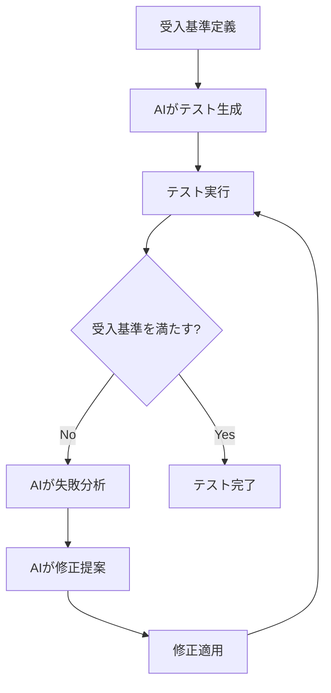

# Playwright MCP 学習メモ

## 概要

Playwright MCPは、Model Context Protocol（MCP）を通じてAIエージェントがブラウザ自動化を実行できるようにするシステムです。AIがPlaywrightの機能を直接利用して、Webページとのインタラクション、テスト実行、自動化タスクを行えます。

## Playwright MCPとは

### 基本概念

- **Playwright**: ブラウザ自動化ツール（Chromium、Firefox、WebKitをサポート）
- **MCP (Model Context Protocol)**: AIモデルと開発者ツールを安全に接続するプロトコル
- **Playwright MCP Server**: PlaywrightのブラウザAutomation機能をMCPツールとして公開するサーバー

### 主要な機能

Playwright MCPサーバーは、以下のブラウザ操作をAIエージェントに提供します：

1. **ナビゲーション**: Webページへの移動
2. **要素操作**: クリック、入力、選択
3. **スクリーンショット**: ページやエレメントのキャプチャ
4. **JavaScript実行**: ブラウザ内でのコード実行
5. **アクセシビリティスナップショット**: ページ構造の取得
6. **ネットワーク監視**: リクエスト/レスポンスの追跡

## AI駆動の自動テスト戦略

### 従来のアプローチ vs AI駆動アプローチ

| 従来のアプローチ | AI駆動アプローチ |
|--------------|--------------|
| 開発者が手動でテストコードを記述 | AIが要件から自動的にテストを生成 |
| 手動でテストを実行・確認 | AIが自動的にテストを実行・検証 |
| エラー発生時に手動でデバッグ | AIが自動的にエラーを分析・修正 |
| テストの保守に時間がかかる | AIが自動的にテストを最適化 |

### AI駆動テストの4つの主要ユースケース

#### 1. 要件ベースのテスト生成

**目的**: 受入基準からPlaywrightテストを自動生成

**プロセス**:
```
要件・受入基準 → AIエージェント → Playwrightテストコード生成
```

**例**:
```
要件:
- 有効な認証情報でログイン成功をテスト
- 無効なパスワードでエラーメッセージをテスト
- 空のユーザー名でバリデーションをテスト

詳細:
- URL: https://myapp.com/login
- ユーザー名フィールド: [data-testid="username"]
- パスワードフィールド: [data-testid="password"]
- 送信ボタン: [data-testid="login-button"]
```

AIは、これらの要件から複数のテストシナリオを識別し、適切なテスト構造とアサーション戦略を決定してPlaywrightテストを生成します。

#### 2. 失敗分析

**目的**: テスト失敗時にAIが自動的に原因を分析

**プロセス**:
```
テスト失敗 → エラーログ・スタックトレース → AIエージェント → 原因特定 → 修正提案
```

**AIが検出する問題**:
- セレクターの問題
- タイミングの問題
- アサーションの不一致
- 状態管理の問題

**自動修正サイクル**:
1. AIが修正案を提示
2. 修正を適用してテスト再実行
3. 成功するまで繰り返し

#### 3. テスト最適化

**目的**: テストコードの品質と保守性を向上

**AIが実行する最適化**:
- 重複コードの検出とリファクタリング
- Page Objectパターンへの変換
- 不安定なセレクターの改善
- パフォーマンスの最適化

**例**:
```typescript
// 最適化前: 重複したログイン処理
test('test 1', async ({ page }) => {
  await page.goto('/login');
  await page.fill('[data-testid="username"]', 'user');
  await page.fill('[data-testid="password"]', 'pass');
  await page.click('[data-testid="login-button"]');
  // テストロジック
});

// 最適化後: 再利用可能なヘルパー関数
async function login(page, username, password) {
  await page.goto('/login');
  await page.fill('[data-testid="username"]', username);
  await page.fill('[data-testid="password"]', password);
  await page.click('[data-testid="login-button"]');
}

test('test 1', async ({ page }) => {
  await login(page, 'user', 'pass');
  // テストロジック
});
```

#### 4. コラボレーション（Three Amigos セッション）

**目的**: プロダクトオーナー、開発者、テスターがAIと協力してテストシナリオを定義

**プロセス**:
1. ユーザーストーリーの定義
2. AIがテストシナリオを生成
3. チームがリアルタイムでレビュー・改善
4. AIが不完全なエッジケースや論理エラーを検出

## Playwright MCP の主要ツール

### 利用可能なMCPツール

| ツール名 | 説明 | 使用例 |
|---------|------|--------|
| `playwright_navigate` | URLに移動 | ログインページへの遷移 |
| `playwright_screenshot` | スクリーンショット取得 | テスト結果の視覚的確認 |
| `playwright_click` | 要素をクリック | ボタンやリンクの操作 |
| `playwright_fill` | フォーム入力 | テキストフィールドへの入力 |
| `playwright_evaluate` | JavaScript実行 | ページ内のデータ取得 |
| `playwright_get_visible_text` | 表示テキスト取得 | コンテンツの検証 |
| `playwright_get_visible_html` | HTML取得 | ページ構造の確認 |

### ワークフローパターン

#### パターン1: フォーム自動化
```
navigate → snapshot → fill → submit → verify
```

#### パターン2: テスト実行
```
navigate → interact → assert → screenshot
```

#### パターン3: データ検証
```
navigate → evaluate → get_visible_text → assert
```

## AI駆動テストの実装アプローチ

### 1. 受入基準駆動テスト（Acceptance Criteria-Driven Testing）

**コンセプト**:
- 各タスクの受入基準を明確に定義
- AIが受入基準を満たすまで自動的にテスト・修正を繰り返す

**実装フロー**:


### 2. セルフヒーリングテスト（Self-Healing Tests）

**コンセプト**:
- テストが失敗した際、AIが自動的に原因を特定し修正
- 不安定なセレクターを自動的に改善

**実装例**:
```typescript
// AIが不安定なセレクターを検出
// 修正前: CSSセレクター（変更に弱い）
await page.click('.btn-primary');

// 修正後: data-testid（安定）
await page.click('[data-testid="submit-button"]');
```

### 3. 継続的テスト改善（Continuous Test Improvement）

**コンセプト**:
- テスト実行のたびにAIがパフォーマンスと品質を分析
- 自動的に最適化提案を生成

**改善項目**:
- テスト実行時間の短縮
- フレーキーテストの特定と修正
- テストカバレッジの向上
- コードの可読性と保守性の改善

## Playwright MCP のセットアップ

### 前提条件

- Node.js 20.x以上
- Playwright インストール済み

### MCP設定（Kiro IDE）

`.kiro/settings/mcp.json`:
```json
{
  "mcpServers": {
    "playwright": {
      "command": "npx",
      "args": ["-y", "@playwright/mcp@latest"]
    }
  }
}
```

### Playwright インストール

```bash
# Playwrightのインストール
npm install -D @playwright/test

# ブラウザのインストール
npx playwright install
```

## AI駆動テストのベストプラクティス

### 1. 明確な受入基準の定義

**良い例**:
```
受入基準:
- WHEN ユーザーが有効な認証情報を入力する
  THEN システムはダッシュボードにリダイレクトする
- WHEN ユーザーが無効なパスワードを入力する
  THEN システムは「パスワードが正しくありません」というエラーメッセージを表示する
```

**悪い例**:
```
受入基準:
- ログインが動作すること
```

### 2. 段階的なテスト生成

1. **Phase 1**: 基本的なハッピーパステスト
2. **Phase 2**: エラーケースとバリデーション
3. **Phase 3**: エッジケースと境界値テスト

### 3. AIフィードバックループの活用

```
テスト実行 → 結果分析 → 改善提案 → 適用 → 再実行
```

### 4. テストの独立性を保つ

- 各テストは独立して実行可能
- テスト間で状態を共有しない
- セットアップとクリーンアップを適切に実装

## まとめ

Playwright MCPを活用したAI駆動テスト戦略により、以下が実現できます：

1. **自動テスト生成**: 受入基準からテストを自動生成
2. **自動失敗分析**: エラーの原因を自動特定・修正
3. **継続的最適化**: テストコードの品質を自動改善
4. **セルフヒーリング**: 不安定なテストを自動修正
5. **高速フィードバック**: 受入基準を満たすまで自動反復

これにより、開発者は手動テスト作成・デバッグから解放され、より高度な設計や機能開発に集中できます。
